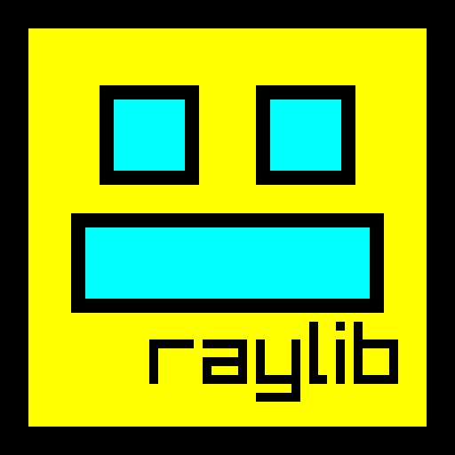

<p align="center">
    </img>
    <h1 align="center">Godot Dash</h1>
</p>

A Geometry Dash remake made with Raylib.

## How to play the game

~~Head to the Actions tab and download the latest buildartifact.~~
The GitHub workflows used to automate building of the game does not work. If you know how workflows work and know how to fix it, feel free to open a PR.

## Build Instructions

### Installing Dependencies

Before building the project, you will need to install all relevant dependencies for your platform so that the project has access to all the tools required, and raylib can compile and link correctly. You can find intructions for installing dependencies on macOS, Linux, and Windows in the [docs file on installing dependencies](docs/InstallingDependencies.md).

### Building the Project

Once you have cloned this repository and installed dependencies, building the project is as simple as running these two commands in its root directory:

#### macOS & Linux

```console
$ make setup
$ make
```

#### Windows

```console
> mingw32-make setup
> mingw32-make
```
